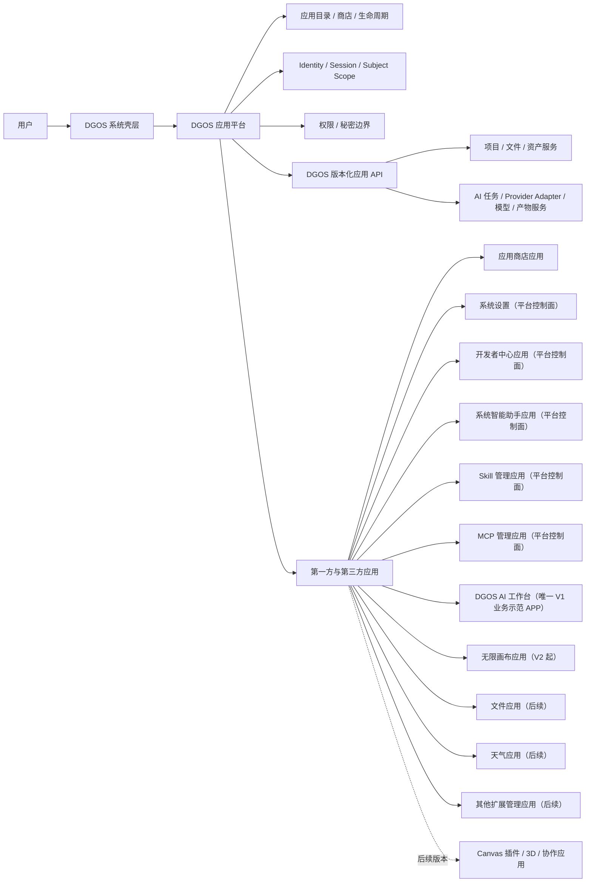
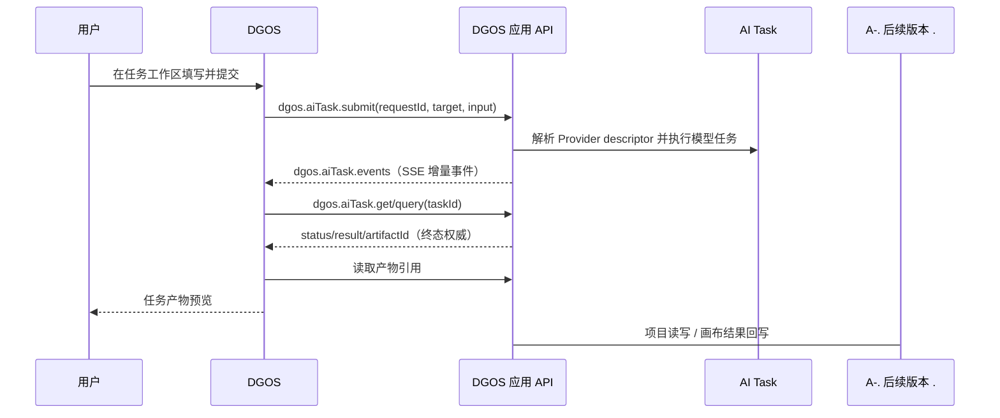

# V1 总体架构

## 1. 架构结论

DGOS 是独立系统，不由 DX OS 加载，也不依赖其运行时和协议。DX OS 只作为产品行为与交互参考。DGOS 的逻辑架构分为系统壳层、应用平台、系统服务和应用生态；V1 桌面发行目标为 macOS，Web 入口支持 Docker Compose 本地部署，两者消费同一套前端应用包、设计系统、路由语义和版本化 DGOS API。Windows 从 V1 起保留可替换的宿主适配边界，但不计入 V1 交付。V1 技术基线为 React/TypeScript/Vite、Tauri 2 + Rust、Node.js + Fastify、独立 Node Worker、PostgreSQL、Redis、S3/MinIO 和 `extension-runner`，详见 [ADR-0003](../../06-决策记录/ADR/0003-V1技术栈与可替换运行时.md)。应用通过 DGOS manifest、运行时上下文和 capability broker 接入平台；Provider 通过协议注册表和能力描述接入 AI Task。字段级设计见 [V1 DGOS 应用清单与运行时契约](V1-DGOS应用清单与运行时契约.md)。

## 2. 运行应用职责

| 组件 | 职责 | 不负责 |
| --- | --- | --- |
| DGOS 系统壳层 | 桌面导航、窗口/工作区容器、应用启动与系统上下文 | 应用领域逻辑 |
| DGOS 应用平台 | 应用规范、目录、安装/启停/升级、权限判定和应用 API | 每个应用的专属业务页面 |
| DGOS 系统服务 | 身份、项目/文件、模型、任务、产物、动作目录和事件等版本化能力 | 应用呈现和交互编排 |
| 第一方/第三方应用 | 在授权范围内调用 DGOS API 并管理自身领域交互 | 直接访问其他应用私有数据或系统秘密 |
| 扩展运行环境 | 按声明注册 Skill、MCP、Canvas 节点等能力并隔离执行 | 修改 DGOS 核心或绕过权限服务 |

V1 平台控制面包括应用目录/商店、系统设置、开发者中心、Skill 管理、MCP 管理和系统智能助手；唯一业务示范 APP 为 DGOS AI 工作台。Skill 管理、MCP 管理和系统助手是默认安装的官方应用，分别负责扩展管理和安全动作入口；系统设置只提供快捷入口和系统级摘要。文件、无限画布、天气、音乐、二维码和网盘等按路线图或应用生态后续接入。应用目录、安装、更新、身份、Provider、动作目录和权限判定属于系统服务，由这些应用通过 DGOS API 调用；系统服务本身不等同于用户界面应用。

### 1.1 V1 部署与宿主边界

| 入口 | V1 要求 | 宿主专属能力 |
| --- | --- | --- |
| macOS 桌面 | 可独立启动、安装应用、管理窗口并运行线性 AI 任务 | Dock/菜单、文件选择器、钥匙串、进程生命周期 |
| Docker Compose Web | 可在本地启动 Web、API、Worker 及依赖并通过健康检查访问 | 浏览器窗口、浏览器文件选择、Web 安全策略 |
| Windows 桌面 | V1 不交付；保留宿主适配接口和能力矩阵 | 后续替换窗口、文件、凭据和生命周期实现 |

桌面和 Web 的领域行为必须通过 DGOS API/SDK 表达。宿主适配层只提供窗口、文件、凭据、生命周期等平台能力，不得形成第二套 Provider、AI Task 或应用权限契约。

## 3. 请求链路

## 4. 数据与事务边界

| 场景 | 事务边界 | 幂等策略 | 失败补偿 |
| --- | --- | --- | --- |
| AI 提交 | 一次 requestId 对应一个 task | 复用 requestId，轮询同一 taskId | 查询/取消，不重复提交 |
| 任务产物预览 | artifactId 读取 | 同一 artifactId 重试读取 | 保留任务终态和错误 |
| 项目保存（后续版本） | DGOS 项目服务的一次文档版本写入 | 版本校验和幂等请求 | 保留旧版本，提示重载或合并 |
| 应用升级（平台版本） | 新包验证+健康检查 | package/version/build 唯一 | 恢复旧包和兼容的数据版本 |

## 5. 明确不采用

| 方案 | 不采用原因 | 重新评估条件 |
| --- | --- | --- |
| 直接复用 DX OS 私有 API 或 Bridge | 会把参考系统协议误当成 DGOS 契约 | DGOS 完成自有 API/SDK ADR，并明确自身版本边界与迁移策略 |
| 由单个应用私自持有共享项目和系统秘密 | 破坏应用隔离、授权和可迁移性 | 不适用；由 DGOS 系统服务统一定义所有权 |
| 应用自拼供应商 endpoint/API Key | 造成权限、任务状态和秘密管理分裂 | 通过 DGOS 版本化能力服务接入 |
