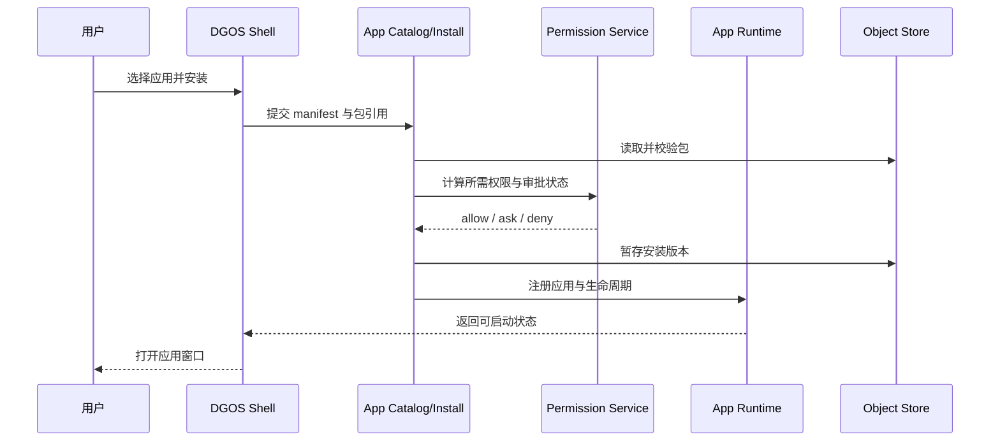
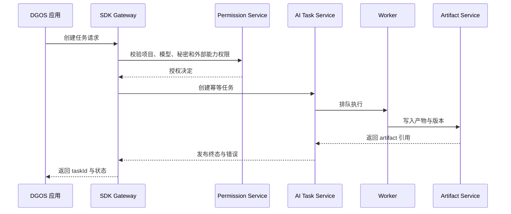

# DGOS 总体架构

## 1. 架构定位

DGOS 是独立运行的通用应用操作系统与应用平台。它提供自己的桌面/窗口壳层、应用规范、应用运行时、应用目录、身份/会话、权限、Provider、扩展和系统服务；桌面端与 HTTPS Web 端共用同一套前端应用包、设计系统、路由语义和版本化 DGOS API。DX OS、其 Bridge、私有 API、数据模型和技术栈只属于参考资料，不是 DGOS 的运行依赖或兼容目标。AI 创作只是首批应用场景，任何符合 DGOS 契约的业务应用都可以接入。

跨版本保持以下边界稳定：应用通过 DGOS manifest、SDK 和版本化 API 接入系统；系统服务拥有各自的数据；应用之间不直接读写彼此私有状态；跨域写入通过显式 API 或事务编排完成。

## 2. 核心原则

- **平台独立**：DGOS 可以以桌面端和 HTTPS Web 形态运行，均由 DGOS 自身启动和提供服务。
- **单一数据所有权**：每类终态数据只有一个领域所有者；缓存、索引和派生视图不可取代权威数据。
- **应用可替换**：系统壳层不内置应用业务逻辑；内置应用和第三方应用遵守同一 manifest、SDK、权限和生命周期规范。
- **显式跨域**：跨领域写入必须调用公开服务接口；禁止通过共享表、私有数据库或未登记的进程内全局状态绕过边界。
- **权限先于副作用**：安装、文件访问、模型调用、秘密使用、外部网络和任务执行都由 DGOS 权限服务在副作用前校验。
- **可追踪任务**：异步 AI、导入、导出和扩展执行都有 DGOS 自有的稳定任务 ID、状态、取消/重试语义和审计记录。
- **文件与知识库受控访问**：V1 文件/知识库能力只通过 DGOS 文件与索引服务提供应用作用域引用、最小字段读取和检索结果；Agent、Skill、MCP 不获得宿主绝对路径或任意目录访问。V2 Project/Canvas 才拥有项目文档写入和结构化知识库编排。
- **失败可恢复**：安装、更新、导入和跨域编排采用暂存、校验、提交或回滚；半成品不得成为业务终态。
- **秘密不出边界**：秘密由 DGOS Secret Service 或受控外部秘密存储管理，应用只得到脱敏状态或短时授权句柄。
- **契约优先**：manifest、SDK、API、数据 schema 和错误语义先冻结，再实现应用和服务；DX OS 证据不能替代 DGOS 契约。
- **身份先行**：V1 先冻结 UserProfile、Session 和 `subjectType/subjectId` 主体作用域，预留多用户 API 与存储模型但不交付正式账号；V2 接入正式登录，V6 扩展 organization/team，不因账号演进重写资源所有权。
- **Provider 统一适配**：真实模型调用必须经过 DGOS Provider Adapter；V1 首批协议为 `openai-compatible`，由可扩展协议注册表和能力描述符驱动；应用不持有供应商密钥、endpoint 或供应商任务状态。
- **能力统一管理**：Provider、Skill、MCP、权限、秘密、任务、事件、应用安装和生命周期由 DGOS 系统服务管理，应用通过公开契约消费，不复制私有平台。
- **助手受控编排**：内置助手通过 Action Registry 发现应用动作；自然语言和快捷指令最终都走 Capability Broker、统一 Executor、任务状态和审计，不能绕过应用边界。

## 3. 逻辑层次

```text
DGOS Shell
  ├─ Desktop / Window Manager / Dock / Launcher
  ├─ App Window Host / System Settings
  └─ HTTPS Web Entry（与桌面入口消费同一 DGOS API）

DGOS App Runtime
  ├─ Manifest Loader / Lifecycle Manager
  ├─ App Sandboxing / Capability Broker
  └─ SDK Gateway（版本化 API、事件和任务订阅）

DGOS Platform Control Apps
  ├─ App Store / System Settings / Developer Center
  ├─ Skill Manager App / MCP Manager App
  └─ System Assistant（V1 受控入口）

DGOS Reference App
  └─ DGOS AI Workbench（V1）

DGOS First-Party Apps
  ├─ File / Weather / Conversation Agent
  └─ Infinite Canvas（V2 起）

DGOS Core Services
  ├─ Identity & Session
  ├─ Permission & Policy
  ├─ Secret & Configuration
  ├─ App Catalog & Installation
  ├─ Project & File
  ├─ Model & Provider
  ├─ AI Task
  ├─ Action Registry & Assistant Gateway
  ├─ Artifact & Asset
  ├─ Audit & Notification
  └─ Search / Index（派生能力）

DGOS Extension Runtime
  ├─ Skill Runtime
  ├─ MCP Connector Runtime
  ├─ Agent Runtime
  └─ Plugin / Node Runtime（按版本启用）

Persistence / Infrastructure
  ├─ Transactional Store（权威业务数据）
  ├─ Object Store（文件、artifact、安装包）
  ├─ Queue / Scheduler（异步任务）
  ├─ Cache（可重建状态）
  └─ Observability（日志、指标、追踪、审计）
```

## 4. 目录与模块

V1 已接受的具体技术栈见 [ADR-0003 V1 技术栈与可替换运行时](../06-决策记录/ADR/0003-V1技术栈与可替换运行时.md) 和 [技术栈专项](当前版本/V1-技术栈候选与专项讨论.md)。目录反映稳定的所有权边界；未来替换 Worker/API 运行时不得改变公共契约：

```text
repo-root/
  apps/                 # DGOS Shell、第一方应用和开发工具
  packages/             # manifest、SDK、共享类型和 UI 基础设施
  services/             # 逻辑领域服务；V1 可运行在同一进程
  runtimes/             # App / Skill / MCP / Agent / Plugin 运行时
  storage/              # migrations、对象存储适配和索引适配
  tests/                # 契约、集成、E2E 和发布门禁测试
  docs/                 # 文档中心与证据链
```

## 5. 运行进程

V1 采用模块化单体优先：逻辑领域先隔离，物理进程按部署和安全需要合并。桌面端可以将 Shell、App Runtime 和 Core API 作为一个受控发行包；HTTPS Web 使用相同 API 契约，不复制领域逻辑。

| 进程/运行单元 | 职责 | 不负责 |
| --- | --- | --- |
| DGOS Shell | 桌面、窗口、Dock、启动台、系统设置入口和应用窗口承载 | 不拥有应用业务数据，不绕过权限调用服务 |
| DGOS API/Runtime | manifest、生命周期、SDK 网关、系统服务编排和会话 | 不替应用保存未声明的私有状态 |
| Worker/Scheduler | AI、导入导出、索引和扩展任务的排队、执行、重试 | 不直接接受未授权的用户副作用请求 |
| Extension Runner | 隔离执行 Skill、MCP、Agent 和后续插件/节点能力 | 不读取其他应用私有数据或明文秘密 |
| Persistence Adapters | 事务库、对象存储、队列、缓存和搜索适配 | 不定义业务权限或跨域写入规则 |

应用商店、开发者中心、文件、天气、对话智能体、Skill 管理、MCP 管理和无限画布的用户界面都是可启动的 DGOS 应用。V1 的 Skill 管理和 MCP 管理是默认安装的官方应用，设置页只保留系统级快捷入口。应用目录、安装、更新和权限判定属于应用平台系统服务，由这些应用通过 DGOS API 调用；系统服务本身不等同于用户界面应用。

## 6. 领域模块

| 模块 | 职责 | 数据所有权 | 依赖方向 |
| --- | --- | --- | --- |
| Identity & Session | 用户、会话、设备和登录状态 | 用户与会话 | 被权限和审计依赖 |
| Permission & Policy | 应用、项目、artifact、秘密和外部能力授权 | 权限、策略、授权决定 | 依赖身份；被所有副作用域依赖 |
| App Catalog & Install | manifest、版本、安装、启动、升级、卸载、回滚 | 应用包与安装状态 | 依赖权限、对象存储和运行时 |
| Project & File | 项目、文件夹、文件引用和项目版本 | 项目与文件元数据 | 依赖身份、权限、对象存储 |
| Model & Provider | 提供商配置、模型目录、能力和健康状态 | 模型配置与能力目录 | 依赖秘密、权限和供应商适配器 |
| AI Task | 任务创建、状态机、取消、重试和执行记录 | 任务与运行记录 | 依赖模型、权限、队列和 artifact |
| Action Registry & Assistant | 应用动作声明、发现、计划、确认和统一执行入口 | 动作声明、动作运行和助手历史摘要 | 依赖身份、权限、Agent/Task 和应用运行时 |
| Artifact & Asset | 产物、版本、引用、导入导出和保留策略 | artifact 元数据与授权索引 | 依赖项目、权限和对象存储 |
| Audit & Notification | 安全审计、用户可见事件和系统通知 | 审计与通知记录 | 只追加写入，读取按权限开放 |
| Extension Runtime | Skill、MCP、Agent 及插件执行边界 | 扩展注册与执行记录 | 依赖 manifest、权限、秘密和任务 |

## 7. 数据边界

| 存储 | 内容 | 权威来源 | 约束 |
| --- | --- | --- | --- |
| 事务存储 | 用户、安装、项目、权限、任务和 artifact 元数据 | 对应领域服务 | 事务边界内校验所有权和版本 |
| 对象存储 | 应用包、文件、artifact 二进制和导出包 | Project/Artifact/App 服务 | 通过受控引用访问，不能以路径代替授权 |
| 队列 | 异步任务、重试和调度消息 | AI Task/Import 服务 | 消息幂等，失败可重试或进入死信 |
| 缓存 | 会话短状态、目录和能力查询缓存 | 可重建 | 不作为终态数据或权限判定唯一来源 |
| 搜索索引 | 文件、应用和 artifact 的检索视图 | 对应领域服务 | 可重建，记录版本或水位 |
| 审计存储 | 权限决定、安装变更、秘密使用和外部副作用 | Audit 服务 | 追加写入，禁止秘密明文 |

## 8. 核心调用链路

### 8.1 应用安装与启动



### 8.2 AI 任务与 artifact



## 9. 拆分条件

V1 在模块化单体内保持逻辑边界和契约隔离。只有出现以下信号时才拆分物理服务：

- 安全边界不同，需要独立沙箱、账户或网络出口；
- Worker、扩展执行或渲染任务的资源曲线影响 Shell/API 的稳定性；
- 某领域需要独立水平扩展、版本发布或数据保留策略；
- 跨进程调用已有稳定 API、幂等、超时、重试、审计和回滚语义；
- 监控数据证明合并部署已成为容量或故障隔离瓶颈。

未满足这些条件时，不为“看起来像微服务”而拆分；先在同一发行包中保持单一契约和可测试边界。
